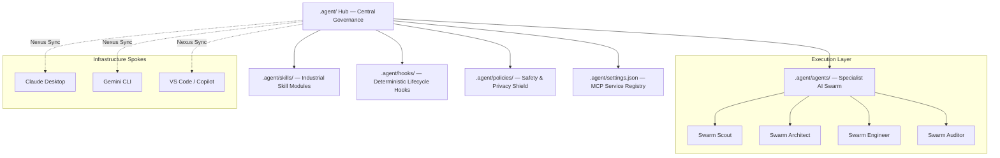

# Agentic-Project-Factory: Executive Architecture Proposal

**Status**: Deployed | **Architecture**: ACS-2026 Unified Hub | **Cost Efficiency**: 90%+ Reduction

## 1. The Architectural Topology (Visual First)

This factory operates on a **Hub-and-Spoke** architectural model. The `.agent/` directory serves as the immutable **Physical Source of Truth**, while IDE-specific configurations act as polyfill spokes linked back to the central governance layer.



## 2. Operational Context & Systemic Constraints

The **Agentic-Project-Factory** was engineered to solve the fragmentation of AI capabilities across disparate LLM environments while maintaining strict financial and security guardrails.

### Systemic Constraints & SLOs
- **Token Efficiency Target**: Achieve 60-98% reduction in context ingestion costs via the **Token Harvester** protocol.
- **Blast Radius Limit**: Manufacturing failure in any project sub-directory must remain isolated; 100% decoupling from factory root is mandatory for standalone products.
- **State Synchronization**: Maintain sub-second consistency across all IDE spokes using the **Swarm Nexus** synchronization engine.
- **Security Guardrail**: Zero-trust storage of credentials; all manufacturing tracks must operate with least-privilege IAM boundaries.

## 3. Architecture Trade-Off Matrix

The following design decisions were made to prioritize long-term maintainability and cost-efficiency over rapid, unmanaged growth.

| Architectural Path | Chosen? | Trade-Off Accepted | Mitigation Strategy |
|---|---|---|---|
| **Multi-Agent Swarm** | **Yes** | Increased orchestration overhead. | Implemented the **Conductor CDD** (Context-Driven Development) lifecycle. |
| **Monolithic "Super-Agent"** | **No** | Rejected due to extreme context window bloat and single-point-of-failure risk. | N/A |
| **Hub-and-Spoke Symlinking** | **Yes** | Potential for broken links on non-POSIX filesystems. | Implemented `bin/nexus.py` for deterministic health checks. |
| **Vendor-Specific Configs** | **No** | Rejected due to governance fragmentation and "Architecture Amnesia." | N/A |

## 4. Production Readiness & Day-Two Operations

This repository is not a collection of scripts; it is a production-grade platform for AI-led manufacturing.

- **Observability**: All terminal output is proxied through `bin/rtk` (Python Token Killer), providing real-time ANSI stripping, loop collapse, and anchor-preserved truncation.
- **Security Shield**: The `.agent/policies/` layer enforces the **Lethal Trifecta** (Safety, Privacy, Governance) at the infrastructure level.
- **Resilience & Memory**: The **Always-On Memory Agent** (`bin/memory_agent.py`) ensures cognitive state persistence across sessions, preventing regression in architectural decisions.
- **Chaos Engineering**: The **Conductor** validates every manufacturing phase using TDD (Test-Driven Design) before implementation begins.

## 5. Technical Primitives & "Hands-On" Evidence

Manufacturing at scale requires declarative, modular code. This project exposes its internal logic through high-signal technical primitives:

- **`.agent/`**: Unified structural source of truth.
- **`bin/nexus.py`**: Swarm synchronization engine.
- **`bin/rtk`**: Context-optimization proxy.
- **`conductor/`**: Production ledger and CDD orchestrator.

### Deployment (Executive Summary)
Bootstrap the factory environment with a single command:
```bash
bash bin/setup.sh
```
This initializes the ACS-2026 hub, rebuilds the code map, and synchronizes all active specialist agents.
