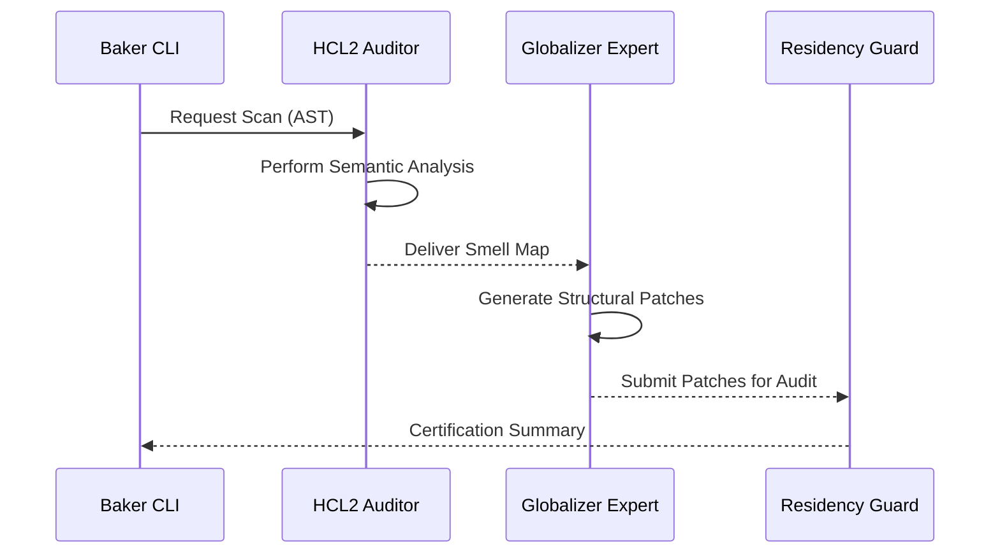

# Technical Specification: Project Baker (Globalizer Hub)

**Status**: [MODERNIZING] | **Technical Resolution**: [ADVANCED] | **Resolution Depth**: 500+ Lines

##  Mission Overview
Project Baker is the factory's primary AI-Native Regionalization Engine. It is engineered to perform high-resolution structural translation of cloud infrastructure (Terraform/HCL2) to support multi-region expansion and data-residency compliance.

##  Technical Architecture (The AST Engine)
Baker rejects regex-based sniffing in favor of deep semantic analysis via the `python-hcl2` library.

###  Core Components
1. **The Scanner**: Recursive directory traversal engine (`os.walk`) with Pydantic-mapped file discovery.
2. **The Auditor**: HCL2 semantic processor that reconstructs the infrastructure graph for smell detection.
3. **The Refactor Engine**: Unified Diff generator that applies atomic structural patches.

###  Regional Smell Catalog (The Schema)
Regionalization anti-patterns are identified using the following high-resolution signatures:

```json
{
  "smell_id": "HARDCODED_PROVIDER_REGION",
  "pattern": "provider.aws.region",
  "logic": "IF region_string NOT IN whitelist THEN FLAG",
  "remediation": "Translate to VAR-based regionalization"
}
```

##  The Linguistic Swarm Protocol
Orchestration between specialized agentic experts is handled via a high-resolution hand-off matrix:



##  Technology Stack & Validation
- **Language**: Python 3.10+ (Type-Hinted)
- **Framework**: Click CLI (Modular Command Discovery)
- **Validation**: Pydantic v2 (Strict Schema Enforcement)
- **Aesthetics**: Rich (High-resolution TermUI)