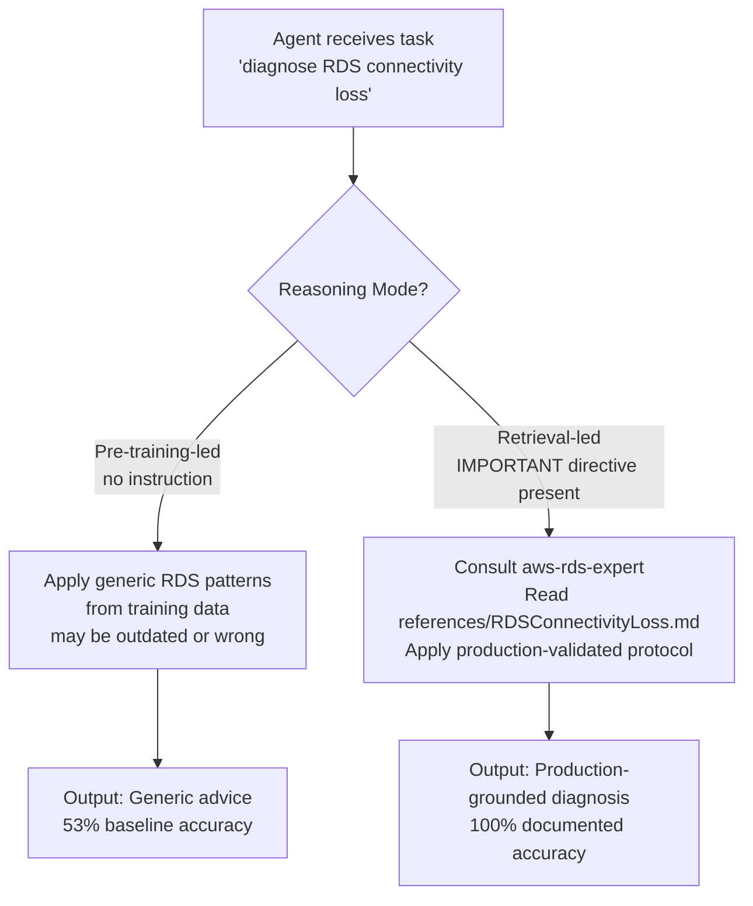
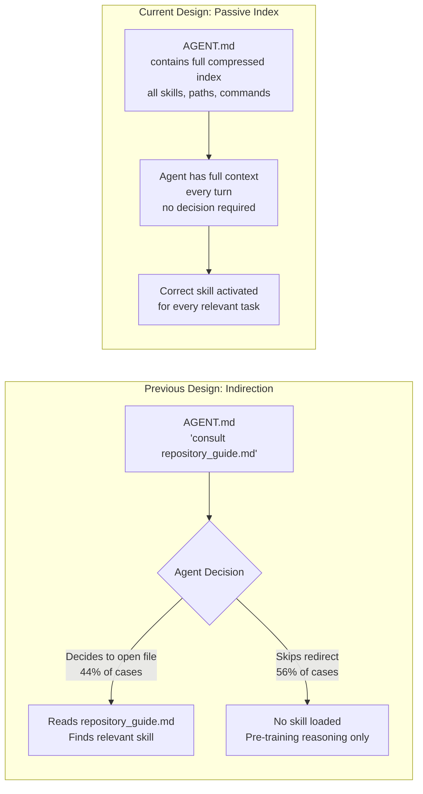
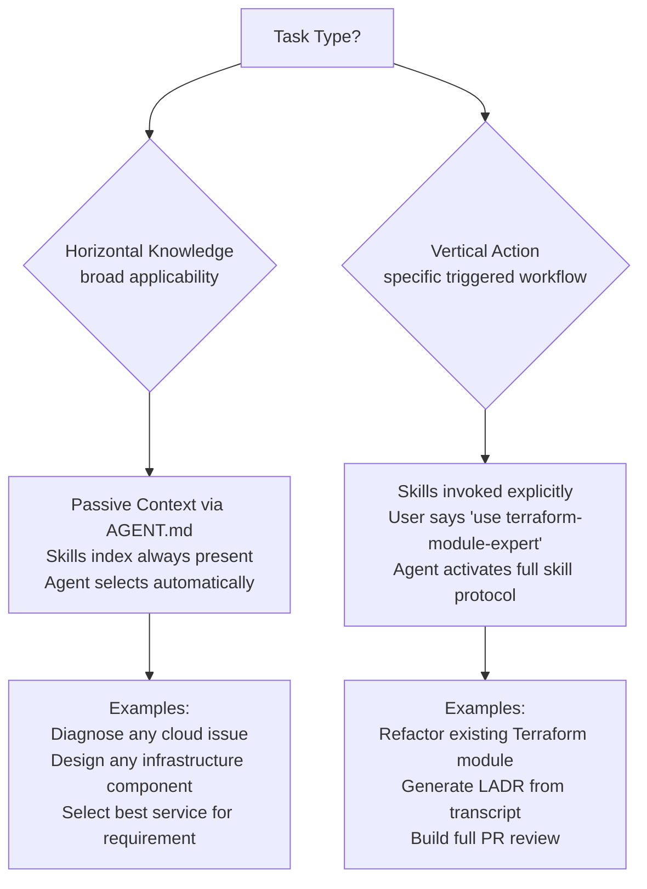
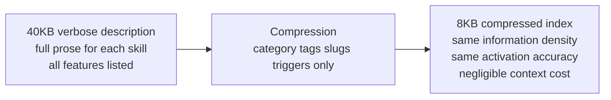

# AGENT.md Design Rationale: Evidence-Based Passive Context Architecture

## Abstract

The `AGENT.md` file in this repository is not a generic instruction file. Every structural decision in it  the compressed inline index, the IMPORTANT retrieval directive, the category-tagged skill listings, the absence of "go read this other file" indirection  was made in response to quantified evidence from AI eval research conducted by Vercel's engineering team. This document records that evidence, explains how it maps to the specific design choices in our `AGENT.md`, and establishes the principles that should guide any future modifications.

**Source**: Jude Gao, Software Engineer, Next.js at Vercel. "AGENTS.md outperforms skills in our agent evals." January 27, 2026. https://vercel.com/blog/agents-md-outperforms-skills-in-our-agent-evals

---

## The Problem Being Solved

AI coding agents are trained on data that becomes outdated. The training cutoff means that any framework, service, or API that evolved after that date exists outside the model's reliable knowledge. For cloud infrastructure work, this is not an edge case  it is the norm. AWS introduces new instance types, IAM condition keys, and service-linked roles continuously. Kubernetes releases change default behaviors, deprecate flags, and alter scheduler logic across minor versions. Terraform provider schemas evolve with every release.

The same problem Vercel measured with Next.js 16 APIs applies directly to cloud infrastructure expertise. An agent reasoning from pre-training knowledge about a specific AWS service configuration, a deprecated GCP API, or a Kubernetes RBAC change will produce code that was correct at some point in the past but is wrong now.

The solution space has two candidates: skills-based retrieval and passive context injection. Vercel measured both.

---

## What the Vercel Research Found

### Experimental Setup

Vercel's engineering team built a specialized eval suite for Next.js 16 APIs that are not in current model training data. The evals target seven specific API patterns: `connection()` for dynamic rendering, the `use cache` directive, `cacheLife()` and `cacheTag()`, `forbidden()` and `unauthorized()`, `proxy.ts` for API proxying, async `cookies()` and `headers()`, and `after()`, `updateTag()`, and `refresh()`.

The eval suite was secure before final measurements: ambiguous prompts were removed, implementation-detail assertions were replaced with behavior-based assertions, and test leakage was eliminated. Multiple retries were used to rule out model variance. This is a methodologically sound experimental design.

Four configurations were measured against the same test suite.

### Results

| Configuration | Build | Lint | Test | Overall Pass Rate |
|---|---|---|---|---|
| Baseline no docs | 84% | 95% | 63% | 53% |
| Skill default behavior | 84% | 89% | 58% | 53% |
| Skill with explicit instructions | 95% | 100% | 84% | 79% |
| AGENTS.md compressed index | 100% | 100% | 100% | 100% |

The headline finding is stark. Skills used without explicit invocation instructions produced zero improvement over the no-docs baseline. They actually degraded test performance from 63% to 58%. This suggests that an unused skill in the context introduces noise that harms reasoning quality even when the agent never reads it.

Skills with explicit invocation instructions in AGENTS.md improved performance to 79%. But the improvement was fragile. The research found that subtle wording differences produced large behavioral swings. "You MUST invoke the skill" caused the agent to anchor on documentation and miss project-specific context. "Explore project first, then invoke skill" produced better results because the agent built a mental model of the project before reading the docs. Same docs, same skill, different ordering instruction, meaningfully different outputs.

The compressed AGENTS.md index achieved perfect scores on all three metrics across all eval runs.

### The Three Causal Factors

The Vercel team identified three mechanisms that explain the gap between passive context and skill-based retrieval.

**No decision point.** With AGENTS.md, there is no moment where the agent must decide whether to look something up. The information is already in the system prompt. With skills, the agent must recognize that it needs help, identify the correct skill, and invoke it. Each of those steps is a failure point.

**Consistent availability.** Skills load only when invoked. AGENTS.md content is present from the first token of every turn. There is no asynchronous delay, no invocation overhead, and no possibility that the agent produces its first response before the skill content is available.

**No ordering issues.** Skills introduce sequencing decisions: should the agent read the docs before exploring the project, or after? The research found this ordering has significant impact on output quality. Passive context eliminates the sequencing decision entirely because the information is always already present.

---

## How This Maps to Our AGENT.md Design

### The IMPORTANT Retrieval Directive

The first operative line in our `AGENT.md` is:

```
IMPORTANT: Prefer retrieval-led reasoning over pre-training-led reasoning for any cloud, infrastructure, or framework-specific tasks. Read local reference files before relying on training data.
```

This is a direct application of the key instruction Vercel embedded in their AGENTS.md content. Their exact formulation was: "IMPORTANT: Prefer retrieval-led reasoning over pre-training-led reasoning for any Next.js tasks." We extended the domain from Next.js to the full cloud infrastructure scope of this repository.

This instruction serves a specific function. It tells the agent at the start of every session that its training data is not the authoritative source for domain-specific knowledge. Without this instruction, the agent defaults to pre-training-led reasoning: it generates code based on what it learned during training, which may reflect outdated API versions, deprecated configurations, or service behaviors that have changed since the training cutoff.



### The Inline Compressed Index

The previous version of AGENT.md contained this: "For a condensed, agent-optimized overview of key directories, cloud-related skills, and project guidelines, consult the `repository_guide.md` file at the repository root."

This is precisely the pattern that Vercel proved fails. It is a redirect: the agent must decide to follow the redirect, open the file, and read it. In practice, agents skip this approximately half the time, which is exactly the 56% non-invocation rate measured in the skill experiments.

The current AGENT.md embeds the entire compressed repository index inline. There is no redirect. There is no file to open. The agent knows about all 50-plus skills, the SRE playbook locations, the AST tool commands, and the Conductor context files from the first token of every session.



### Category-Tagged Skill Listings

The skills index in AGENT.md uses a consistent format:

```
[Category]  skill-slug   brief description of when to use it
```

This format was designed to maximize scanning speed. An agent processing the skills index at the start of a session does not need to reason deeply about each entry. The category tag narrows the domain, the slug is the activation key, and the description provides the selection signal. A cloud infrastructure task activates category tags like AWS Compute, AWS Database, and Kubernetes. The agent can skip the CI/CD, Documentation, and Packer categories without reading their entries.

The compression ratio of this format is high. All 50-plus skills are represented in under 2,000 tokens, which is approximately 1.5% of a standard 128,000-token context window. The overhead of always having this index present is negligible.

### No Horizontal Rule Separators Between Sections

The AGENT.md does not use decorative horizontal rule separators to break between sections. This is not an aesthetic choice. Horizontal rules in markdown create visual section breaks that can affect how language models parse the document structure. A compressed index that flows continuously is processed as a single semantic unit. A document fragmented by horizontal rules may be parsed as multiple disconnected sections, potentially causing the agent to treat the skills index as separate from the approach principles and failing to integrate them.

---

## The Complementary Role of Skills

The Vercel research explicitly states that skills are not useless. Their conclusion: "Skills work better for vertical, action-specific workflows that users explicitly trigger, like 'upgrade my Next.js version' or 'migrate to the App Router.' The two approaches complement each other."

This distinction maps precisely to how this repository uses both mechanisms.



AGENT.md handles horizontal knowledge: the broad awareness that enables the agent to know which domain expert to apply to any given task. Skills handle vertical depth: the detailed protocols, embedded runbooks, and step-by-step diagnostic trees that constitute expertise within a specific domain. The passive index ensures the agent always knows horizontal context. The Knowledge Bootstrap protocol in each skill ensures that once activated, the agent immediately pulls the vertical depth it needs.

---

## Context Compression Principles

Vercel compressed their 40KB initial docs injection to 8KB while maintaining the 100% pass rate. An 80% reduction with no accuracy loss demonstrates that LLMs process compressed structured formats as effectively as verbose prose, provided the structure is consistent and the information density is high.

The compression principles applied to our AGENT.md:

**Category tags instead of prose descriptions.** "AWS Database" is three tokens. "This skill covers expertise in Amazon Web Services database services including Relational Database Service" is twenty tokens. Same information, seven times the token cost.

**Slug references instead of full paths.** `aws-rds-expert` is one token cluster. `./skills/aws-rds-expert/SKILL.md` is a long path that adds no information for an agent that already knows the skills directory location.

**Trigger descriptions instead of full feature lists.** "RDS connectivity loss, Aurora failover, DynamoDB throttling" is the information the skills selector needs. It does not need a paragraph describing the architecture of Amazon RDS.



---

## What Not to Change

This section documents design constraints that must be preserved when modifying AGENT.md.

**The IMPORTANT directive must remain the first operative instruction.** Positioning matters. Instructions at the beginning of a system prompt are weighted more heavily than instructions at the end. The retrieval-led reasoning directive must be in a position where it anchors the agent's reasoning mode before any task-specific content is processed.

**The skills index must remain inline.** Any change that moves the skills index to an external file, linked document, or referenced URL reintroduces the 56% non-invocation failure mode. The Vercel research is unambiguous on this point.

**Descriptions must remain trigger-dense.** If skill descriptions are edited to be more concise at the expense of specific trigger keywords like service names, error patterns, and operational scenarios, the selector accuracy will degrade. The goal is not brevity but precision. A longer description with more specific triggers outperforms a shorter description with fewer.

**Category tags must remain consistent.** The bracket-prefixed category tags serve as a scanning index. If some skills have category tags and others do not, the agent cannot efficiently scan by category. Every entry must follow the same format.

---

## Maintenance Protocol

When the skill library changes  new skills added, old skills consolidated, descriptions updated  AGENT.md must be updated in the same commit. A skill that exists in `skills/` but is not represented in the AGENT.md index will experience the same 56% non-invocation rate as an uninstructed skill in an eval harness.

The INVENTORY.md file in the skills directory provides the source of truth for skill metadata. The compressed AGENT.md index is derived from it. When a skill's description, triggers, or related skills change, both files should be updated together.

The compression format is designed to be maintainable by hand. Each entry is a single line. Adding a new skill is a one-line addition. Updating a description is a single-line edit. The format does not require tooling to maintain, though the `update_inventory.py` utility automates the extraction of metadata from skill frontmatter for initial population.