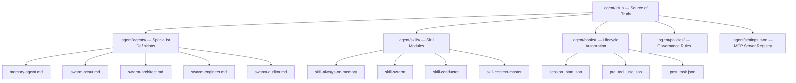
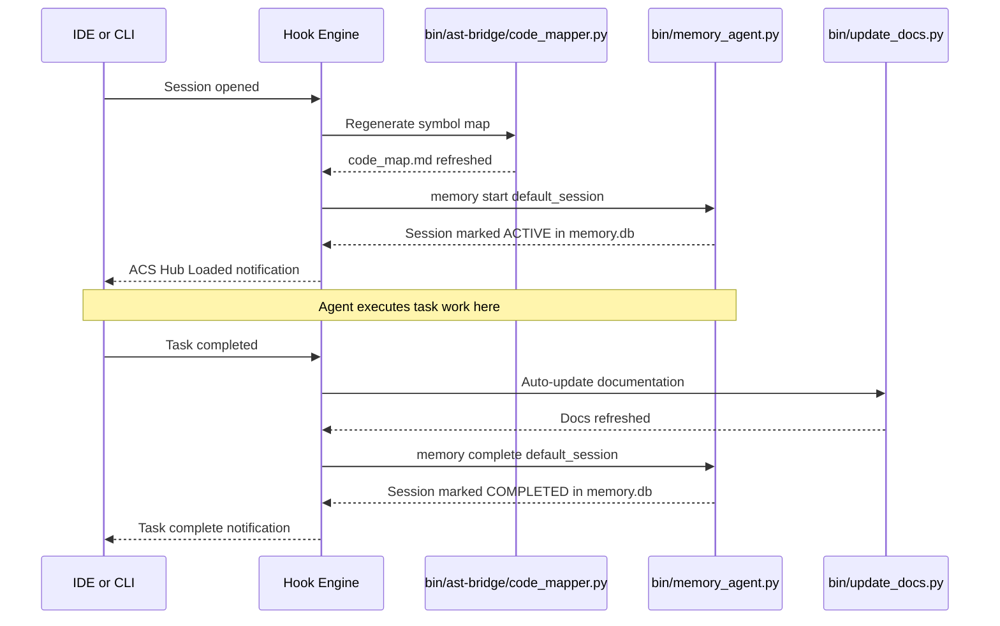
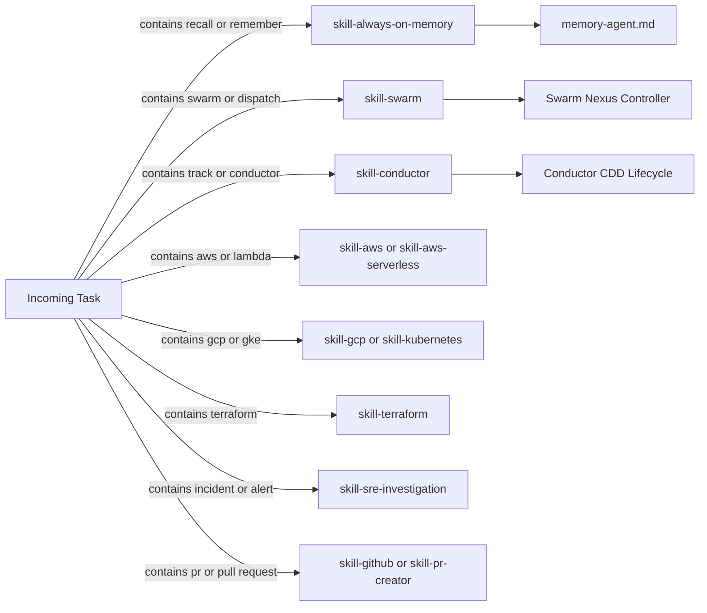
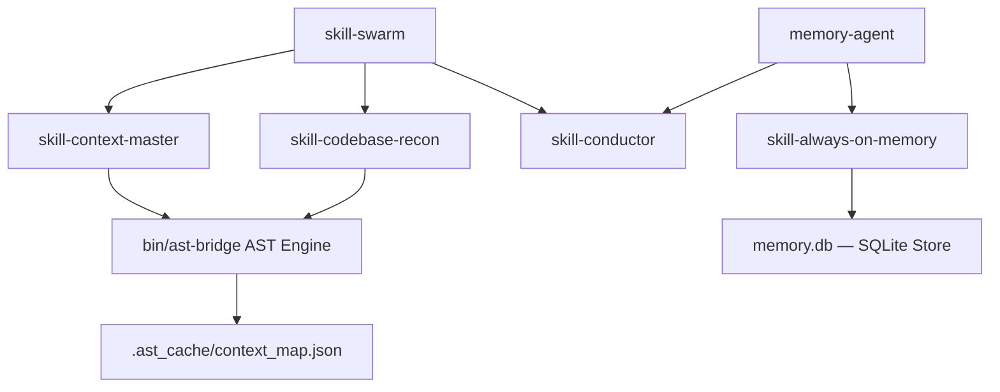
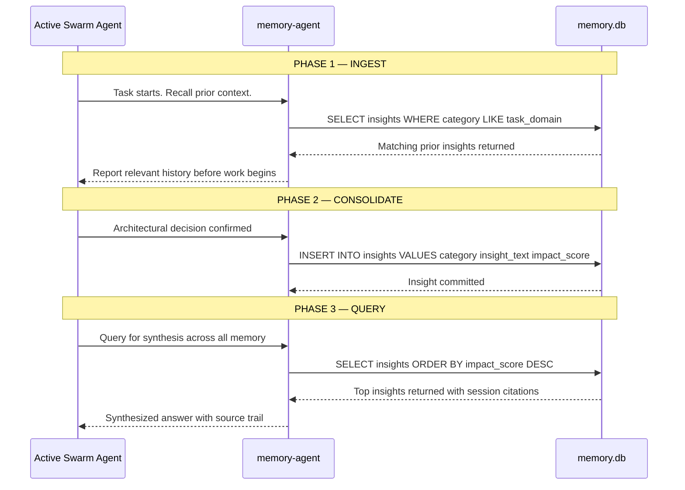
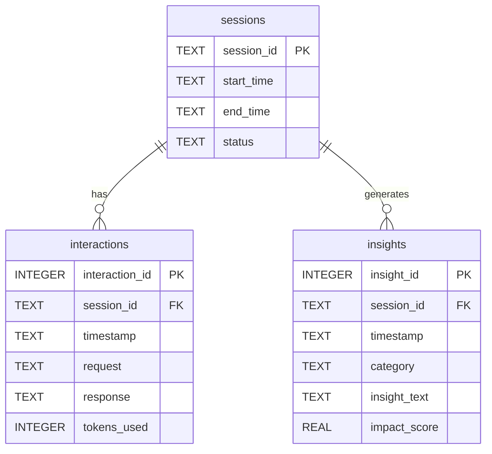
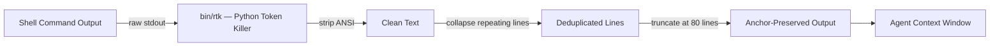

# Agentic Factory: Architecture, Hooks, and Memory System

**Version**: 2026 ACS v1.2 | **Standard**: Unified Agentic Hub

This document explains the full runtime architecture of the Agentic Project Factory — how lifecycle hooks fire, how skills are activated, how the memory layer persists context, and how every component connects.

---

## 1. High-Level Architecture

The factory is organized as a **Hub-and-Spoke** model. The `.agent/` directory is the physical source of truth. All vendor IDE configurations are symlink polyfills pointing back to this hub.



---

## 2. Lifecycle Hook Architecture

Hooks are deterministic JSON-defined event triggers. They fire at exact lifecycle boundaries and execute shell commands or send system notifications. No agent discretion involved — hooks always fire.

### Hook Events

| Hook File | Event | Fires When |
|---|---|---|
| `session_start.json` | `sessionStart` | A new agent session is opened |
| `pre_tool_use.json` | `preToolUse` | Before any tool or command is executed |
| `post_task.json` | `postTask` | After a complete task is marked done |

### Hook Execution Flow



### Current Hook Definitions

**session_start.json** — fires on every new session:
```json
{
  "event": "sessionStart",
  "actions": [
    { "execute": "python3 bin/ast-bridge/code_mapper.py ." },
    { "execute": "python3 bin/memory_agent.py start default_session" },
    { "message": "ACS Hub Loaded. Symbol Map Refreshed." }
  ]
}
```

**post_task.json** — fires at task completion:
```json
{
  "event": "postTask",
  "actions": [
    { "execute": "python3 bin/update_docs.py" },
    { "execute": "python3 bin/memory_agent.py complete default_session" },
    { "message": "Task complete. Documentation updated successfully." }
  ]
}
```

---

## 3. Skill Activation Architecture

Skills are self-contained capability modules inside `.agent/skills/`. Each skill has a `SKILL.md` defining its name, related skills, auto-triggers, and behavioral protocols.

### Tiered Discovery Protocol

Agents MUST follow two-tier loading as defined in `acs.yaml`:

- **Tier 1**: Read skill name and description only. Used for routing decisions.
- **Tier 2**: Load full `SKILL.md` content. Only when the task matches the skill domain.

This enforces the **60-98% token reduction** mandate from the Token Harvester standard.

### Skill Auto-Trigger Map



### Skill Relationship Graph



---

## 4. Always-On Memory System

The memory layer is based on the **Google ADK Always-On Memory Agent** architecture. It gives the swarm persistent, evolving cognitive state across all sessions.

### Three-Phase Cognitive Loop



### Memory Database Schema



### Insight Category Taxonomy

| Category | Score Range | Usage |
|---|---|---|
| `architecture` | 3.0 - 5.0 | Structural design decisions, ADRs |
| `standards` | 4.0 - 5.0 | Protocol standards, frameworks, specs |
| `governance` | 4.0 - 5.0 | Branch policies, compliance, audit gates |
| `security` | 3.0 - 5.0 | Auth patterns, zero-trust, credential rules |
| `sre` | 3.0 - 4.5 | Operational runbooks, port configs, gotchas |
| `performance` | 2.0 - 4.0 | Token costs, bottlenecks, optimization wins |
| `debugging` | 1.0 - 3.5 | Known bugs, error patterns, resolution paths |

---

## 5. Token Harvester Integration

The factory enforces a **60-98% token reduction mandate** via five interlocking frameworks registered in `AGENTS.md Section 2.1`.

| Framework | Tool | Role |
|---|---|---|
| SkillOS Dialects | Internal | `strict-patch` edits, `caveman-prose` logs, `dom-nav` browser tokens |
| Context-Mode | MCP server | SQLite FTS5 gating. Return query matches, not raw dumps |
| Code-Review-Graph | MCP server | Tree-sitter blast radius. Load only touched symbol files |
| Caveman-Prose Ultra | Protocol | Strip articles, niceties, hedging from all agent outputs |
| Python Token Killer | `bin/rtk` | ANSI strip, loop collapse, hard truncation on terminal output |

### Token Filter Flow



---

## 6. Swarm Nexus Synchronization

`bin/nexus.py` is the factory compiler. It ensures the `.agent/` hub is the authoritative source and that all IDE polyfill spokes reflect the latest state.

**Run at any time to recompile**:
```bash
python3 bin/nexus.py
```

**What it does**:
1. Reads all agent and skill definitions from `.agent/`
2. Verifies each symlink polyfill target exists and is correctly linked
3. Warns on any raw files that are NOT symlinks — these represent governance drift
4. Prints a clean compile status on exit

---

## 7. Reference Index

| Resource | Link |
|---|---|
| Always-On Memory Agent Upstream | https://github.com/GoogleCloudPlatform/generative-ai/tree/main/gemini/agents/always-on-memory-agent |
| Plan-Commands Specification | https://github.com/jjdelorme/plan-commands |
| SkillOS Dialects | https://github.com/EvolvingAgentsLabs/skillos/blob/main/docs/dialects.md |
| Context-Mode | https://github.com/mksglu/context-mode |
| Code-Review-Graph | https://github.com/tirth8205/code-review-graph |
| Caveman-Prose | https://github.com/juliusbrussee/caveman |
| RTK Reference | https://github.com/rtk-ai/rtk |
