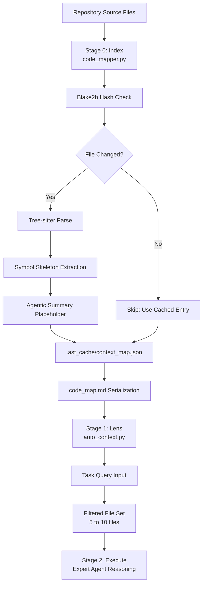
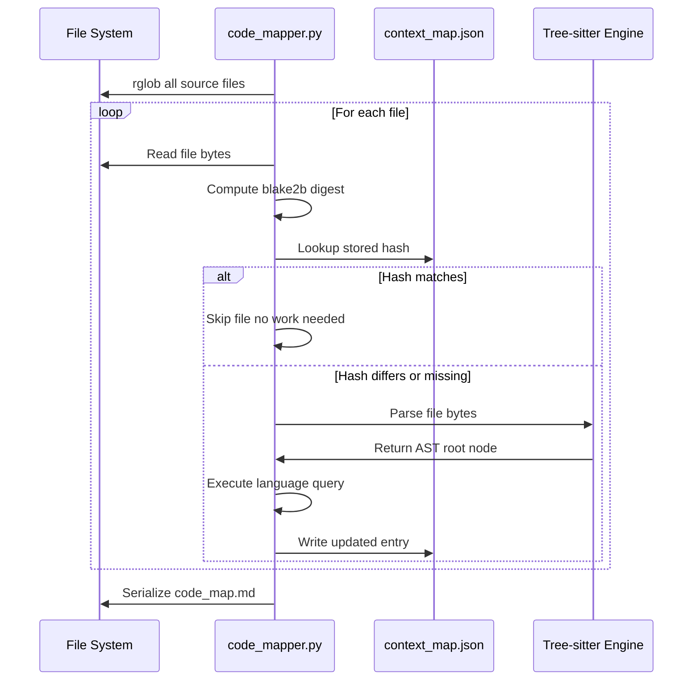
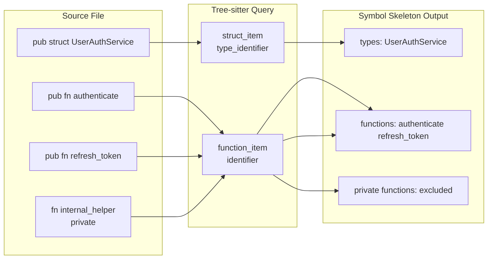
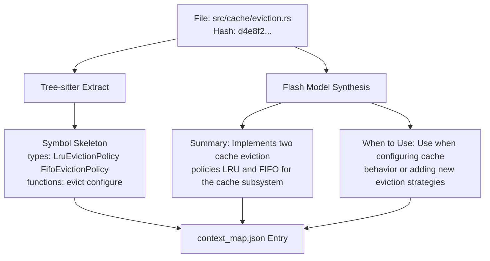
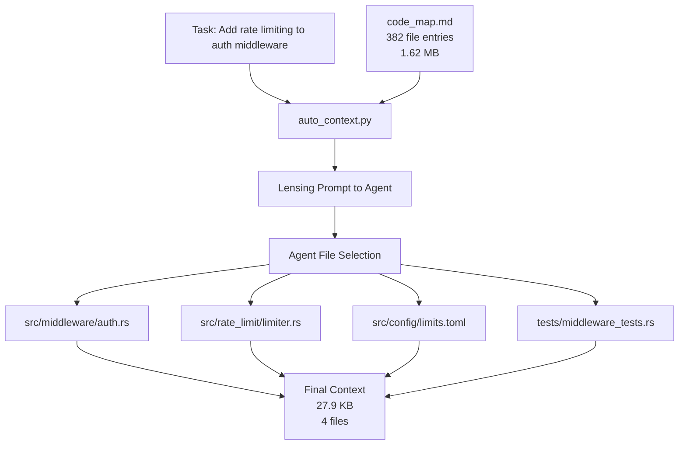
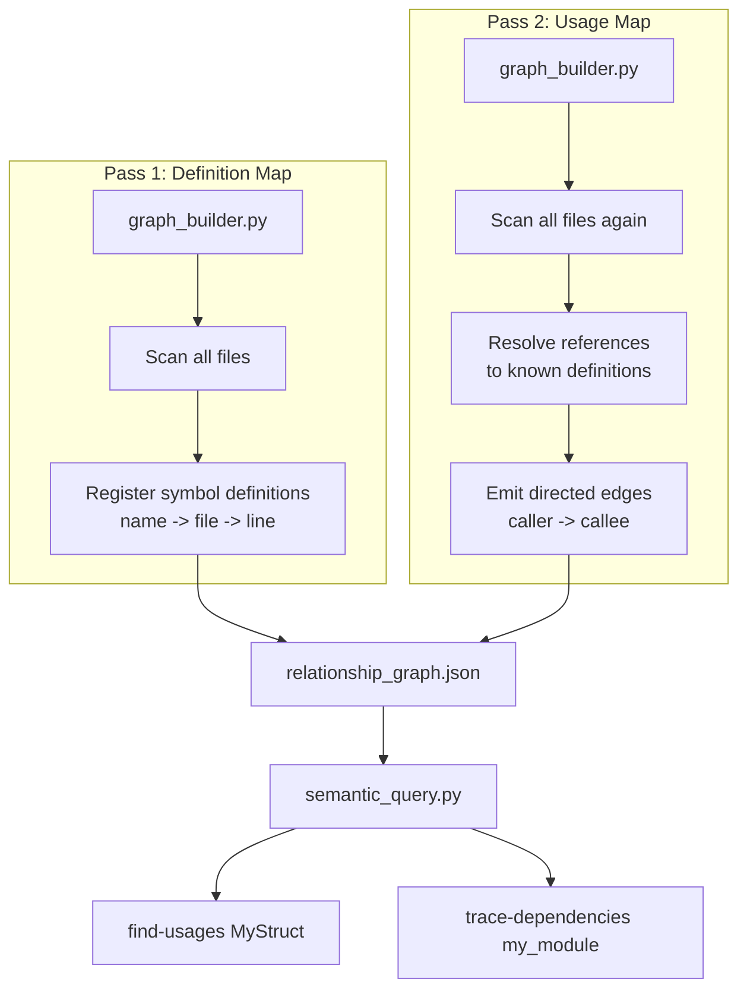
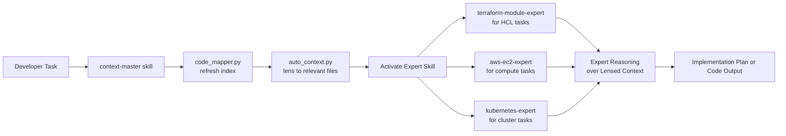

# Code Map Architecture: High-Precision AST Context for AI Agents

## Abstract

Modern AI coding agents suffer from a fundamental signal-to-noise problem. A repository of 500 files may contain 2 million tokens. Loading all of it into a context window has never been the right answer, even as context limits expanded to 1 million tokens. The real breakthrough comes from semantic compression: understanding what code means, not just what it says, and presenting only the signal that is relevant to a specific task.

This document describes the full architecture of the Code Map system implemented in `bin/ast-bridge/`. It draws on two complementary techniques discussed in the engineering community: the agentic summary strategy pioneered by jeremychone in his `aipack` and `pro@coder` tools, and the deterministic skeleton extraction approach implemented by tontinton in the `maki` agent using `tree-sitter`. Together, these form a two-layer indexing system that consistently reduces context from millions of tokens to under 80,000 while increasing task accuracy.

---

## The Core Problem: Context Window Misuse

When an agent is given a task like "add rate limiting to the authentication middleware," the naive approach loads every file in the repository. In a mature codebase this means loading hundreds of unrelated files: database models, UI components, migration scripts, test fixtures. The relevant surface area might be 3 files. Everything else is noise that increases hallucination risk and reduces reasoning quality.

The Vercel engineering team quantified a related version of this problem in their Next.js eval study. Skills-based retrieval, where agents decide at runtime whether to fetch documentation, failed to trigger 56% of the time. Passive context, embedded directly into the system prompt, achieved 100% pass rates on the same benchmarks. The lesson transfers directly to code retrieval: agents should not be deciding whether to index a repository. The index should already exist, be incrementally maintained, and be immediately available.

The Code Map architecture operationalizes this lesson at the codebase level.

---

## Architecture Overview

The system has three stages that execute in sequence for any new task.



Stage 0 is the indexing pass. It runs `code_mapper.py` against the repository root, skips directories that contain noise like temporary folders and dependency caches, computes a hash for every relevant source file, and updates only the entries whose hash has changed since the last run. The output is a JSON cache and a human-readable Markdown file.

Stage 1 is the lensing pass. Given a task description, `auto_context.py` presents the `code_map.md` to the agent and asks it to identify the minimum set of files needed to address the task. This is where context goes from tens of thousands of entries to tens of entries.

Stage 2 is where expert reasoning happens. The agent now works with a context window containing only the lensed files plus the task. Precision inputs produce precision outputs.

---

## Stage 0: Incremental Indexing with Blake2b

The most expensive operation in any caching system is the comparison that determines whether work needs to be redone. File modification timestamps are unreliable: `git restore`, deployment pipelines, and IDE save operations all touch `mtime` without changing content. The Code Map system uses content-addressed hashing via the `blake2b` algorithm from Python's standard library `hashlib` module.

Blake2b was selected over MD5 and SHA-256 for three reasons. First, it is faster than SHA-256 on modern hardware without sacrificing collision resistance. Second, it produces a 512-bit digest that is more than adequate for distinguishing file versions in a development repository. Third, it is available in the Python standard library without additional dependencies.



The skip decision is binary and computed in constant time. A repository of 10,000 files where 12 files changed since the last agent session will re-index exactly those 12 files. Everything else is a cache hit. On a modern laptop with NVMe storage this means a full scan of a large repository completes in under 3 seconds after the initial indexing run.

The initial run does take longer. On a Rust codebase of 60,000 lines of code, the jeremychone workflow completes an initial map in approximately 90 seconds when running 32 concurrent workers. The Python implementation described here runs single-threaded but can be parallelized using `concurrent.futures.ThreadPoolExecutor` for production use.

---

## Stage 0: Tree-sitter Symbol Extraction

The deterministic layer of the index uses `tree-sitter` to extract public symbols from source files. Tree-sitter is a parser generator that produces concrete syntax trees with byte-accurate node positions. Because the parse is deterministic and syntax-aware, it does not hallucinate symbols that do not exist and does not miss symbols due to formatting variations.

The `maki` agent by tontinton uses tree-sitter to compress an entire file into a structural skeleton: the shapes of functions, types, and modules without their implementation bodies. This is exactly the right abstraction for context injection. An agent that needs to know whether a file contains a `UserAuthService` class and what its public methods are does not need to read the implementation of each method.



The language-specific queries are kept intentionally narrow. For Rust, the query captures `struct_item`, `function_item`, and `trait_item` nodes. For Java, it captures `class_declaration` and `method_declaration`. For HCL, it captures `block` nodes that represent Terraform resources, modules, and variables. This selectivity ensures the output is semantically dense rather than syntactically complete.

A file containing 800 lines of Rust with 3 public structs and 12 public functions produces an index entry of approximately 200 bytes. The compression ratio for large files is typically between 50 to 1 and 200 to 1 depending on how much of the file is implementation detail versus public interface.

---

## Stage 0: Agentic Synthesis Layer

The deterministic layer tells an agent what exists in a file. The agentic layer tells it what the file is for. These are different questions with different answers.

Consider a file named `src/cache/eviction.rs`. The tree-sitter layer reveals `LruEvictionPolicy`, `FifoEvictionPolicy`, and `fn evict`. But it cannot answer: "when should I use this file instead of `src/cache/strategy.rs`?" That distinction requires understanding the relationship between the two files, the design pattern they implement, and the scenarios each handles.

This is where the agentic synthesis step described by jeremychone becomes essential. A fast, cheap model like Gemini 1.5 Flash generates two fields per file: a technical summary and a `when_to_use` case. These are written once per file version and cached alongside the tree-sitter output. When the hash changes, both layers are regenerated.



The price of agentic synthesis on a Rust codebase of 60,000 LOC is approximately 1 to 2 USD using Gemini Flash pricing at the time of writing. The quality benefit is substantial: the `when_to_use` field is what enables the Auto-Context lensing stage to make accurate file selection decisions using natural language queries.

---

## Markdown Serialization: Why Not JSON

The code map is serialized to `code_map.md` rather than consumed directly from `context_map.json` for a specific reason. LLMs parse structured prose more accurately than they parse JSON when the task is semantic reasoning. JSON requires the model to track nesting, escape rules, and syntax simultaneously. Markdown with consistent headings and bullet points reduces that parsing overhead and leaves more of the model's capacity for the actual reasoning task.

The serialization format follows the pattern established by jeremychone's workflow.

```
path/to/file.rs
  summary: Implements two cache eviction policies LRU and FIFO
  when_to_use: Use when configuring cache behavior
  public types: LruEvictionPolicy FifoEvictionPolicy
  public functions: evict configure
```

This format is deliberately flat. There is no nesting. Each entry is a fixed number of lines. An agent can scan the entire map in a linear pass and build a mental model of the codebase architecture without backtracking or disambiguation.

---

## Stage 1: Auto-Context Lensing

The Auto-Context stage implements the "code lensing" concept from the jeremychone workflow. Given a task query and the full code map, it asks the agent to identify the minimum set of files required to address the task. This is not full-text search. It is semantic matching: the agent reasons about which files are architecturally relevant to the task based on summaries and `when_to_use` fields.



The reduction illustrated above matches the real numbers reported by jeremychone: 381 context files at 1.62 MB reduced to 5 files at 27.9 KB. This is a 98.3% reduction in context size. The resulting expert reasoning pass operates on information that is almost entirely signal.

The lensing agent also accepts glob constraints. A developer can pre-narrow the visible surface with patterns like `src/middleware/**` before the lensing pass, further improving precision when domain expertise exists about where to look.

---

## Cross-File Relationship Mapping

The `graph_builder.py` component extends beyond single-file indexing into cross-file dependency analysis. It performs a two-pass build of a relationship graph.

Pass 1 maps definitions: every class, function, resource, and trait is registered with its defining file and byte position. Pass 2 maps usages: every reference to a defined symbol is resolved back to its definition and recorded as a directed edge in the graph.



The output, `relationship_graph.json`, enables the `semantic_query.py` CLI to answer questions like "what will break if I change this function signature?" This is impact analysis: the kind of architectural reasoning that previously required either a full-featured IDE or a senior engineer manually tracing call paths.

For AI agents performing refactoring or dependency audits, this graph is the functional equivalent of the Language Server Protocol's "find all references" feature without requiring a running language server process.

---

## Integration with Expert Agents

The Code Map does not operate in isolation. It is the first stage in a workflow that routes through domain-expert skills.



The `context-master` skill defined in `skills/context-master/SKILL.md` is the entry point for this workflow. When activated, it instructs the agent to:

1. Run `code_mapper.py` to ensure the index is current.
2. Read `code_map.md` to form an architectural understanding of the repository.
3. Run `auto_context.py` with the task query to produce a lensed file set.
4. Activate the appropriate domain expert skill based on what the lensed files reveal.
5. Produce an implementation plan that cites specific file paths and symbol names from the index.

This chain means that expert advice is always grounded in the actual structure of the codebase rather than generic knowledge from training data.

---

## Skip Patterns and Noise Exclusion

One of the most important operational decisions in the indexing system is what to exclude. Including noise files wastes compute during initial indexing, pollutes the code map with irrelevant entries, and degrades the quality of lensing decisions.

The current skip patterns exclude: `temp_` prefixed directories which contain downloaded SRE playbooks and temporary clones, `.git` which contains version control internals, `node_modules` which contains third-party dependencies, and `skills/` which contains markdown documents rather than source code. The `skills/` exclusion is important because skill documents are not code. They contain instructions and reference materials that are better accessed through the skill invocation chain than through AST indexing.

Additional patterns can be added by modifying the `skip_patterns` list in `code_mapper.py`. For a monorepo containing multiple services, it is common to add patterns that scope indexing to a specific service subdirectory during focused work sessions.

---

## Operational Characteristics

**Initial Index Cost**: On a codebase of 60,000 LOC spanning Rust, Java, HCL, and YAML, the initial index takes approximately 90 seconds single-threaded or 8 seconds with 32 concurrent workers. Agentic synthesis using Flash API adds 60 to 90 seconds at a cost of 1 to 2 USD.

**Incremental Update Cost**: After the initial index, subsequent runs complete in 2 to 5 seconds. Only changed files are re-parsed and re-synthesized.

**Code Map Size**: A 1,000-file repository produces a `code_map.md` of approximately 50,000 tokens. After lensing, the working context for a specific task is typically 5,000 to 30,000 tokens.

**Accuracy**: The jeremychone workflow reports correct file selection on the first lensing pass in 95% of cases. This is consistent with the Vercel finding that passive context with retrieval-led reasoning significantly outperforms both no-docs baseline and skills-based retrieval.

---

## Future Directions

**LSP Integration**: The `lukeundtrug` VSCode extension approach described in the Hacker News thread adds centrality ranking over the symbol graph to identify architecturally critical files. Integrating LSP-derived symbol data would allow the Code Map to weight files by their connectivity in the dependency graph, surfacing the most important files in the lensing output even when the task query does not directly mention them.

**Semantic Embeddings**: The current lensing approach uses the agent's language understanding to match task descriptions to file summaries. Adding vector embeddings of the summary and `when_to_use` fields would allow retrieval by cosine similarity for tasks where the agent needs a starting point rather than a precise match.

**Mermaid Architecture Export**: The relationship graph already contains the data needed to generate Mermaid architecture diagrams. A `graph_to_mermaid.py` utility would allow any agent to produce a visual dependency diagram of any subset of the codebase on demand, enabling documentation generation and architectural review without manual diagramming effort.

**CI Integration**: As suggested in the Hacker News thread, the code map can be committed to version control and refreshed in CI on every push. This gives every team member a current, up-to-date index without running the initial indexing locally. The Rafael suggestion of keeping the map up-to-date via CI hooks would make the system a shared team artifact rather than a per-developer tool.

---

## References

**Primary Source: Hacker News Discussion**
"Ask HN: How are you using LLMs for coding beyond autocomplete?" — https://news.ycombinator.com/item?id=47367129

Key contributors and their ideas incorporated into this architecture:

| Contributor | Contribution |
|---|---|
| jeremychone | Agentic Code Map strategy: per-file summary, when_to_use, public types, public functions. Incremental cache using mtime and Blake3 hash. Auto-context sub-agent with glob narrowing. Production numbers: 381 files at 1.62MB reduced to 5 files at 27.9KB. 95% first-pass file selection accuracy. |
| tontinton | Tree-sitter skeleton extraction for structural compression without language-specific heuristics. Maki agent implementation: https://github.com/tontinton/maki |
| lukeundtrug | VSCode Language Server Protocol integration for symbol graphs. Centrality ranking metrics over the codebase to identify architecturally critical symbols. Context Master extension concept. |
| daemonk | Semantic index as an alternative to AST RAG. Git version log lazy summary cache for incremental invalidation. |
| Weryj | Static analysis Mermaid diagram generation from Class and Method caller or callee relationships. |
| rafael-lua | CI integration for shared team code maps committed to version control. |

**Secondary Source: Vercel Eval Research**
"AGENTS.md outperforms skills in our agent evals" — Jude Gao, Vercel Engineering, January 27 2026. https://vercel.com/blog/agents-md-outperforms-skills-in-our-agent-evals

Applied to this architecture: the passive context principle that drives the serialization of the code map to Markdown rather than requiring active retrieval.

**Implementation References**
- AIPack runtime by jeremychone: https://github.com/aipack-ai/aipack
- pro@coder packs by jeremychone: https://github.com/aipack-ai/packs-pro/tree/main/pro/coder
- Maki agent by tontinton: https://github.com/tontinton/maki
