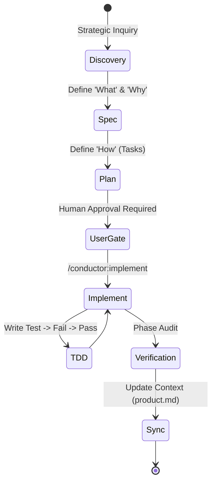
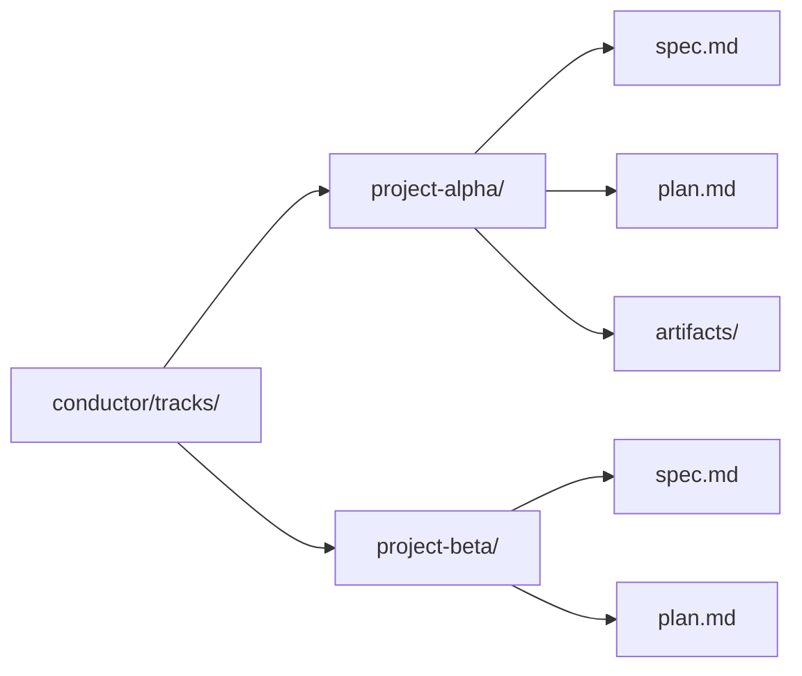

# Conductor: CONTEXT-DRIVEN DEVELOPMENT (CDD)

This document visualizes the strict **Spec-Plan-Implement** lifecycle used to ensure zero information loss and autonomous project management.

## 🔄 The Conductor Loop

Every track follows a deterministic state-machine cycle led by the [**swarm-supervisor**](file://../../agents/swarm-supervisor/SYSTEM.md).

## 📂 The CDD Folder Structure

Tracks are organized into nested folders to maintain isolation and history.

---
*Maintained by the Swarm Supervisor — Status: HARDENED.*
