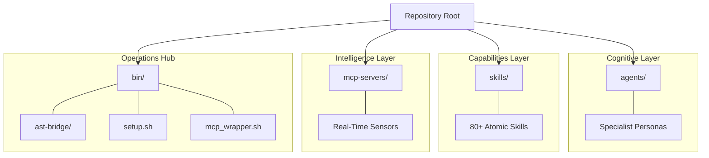
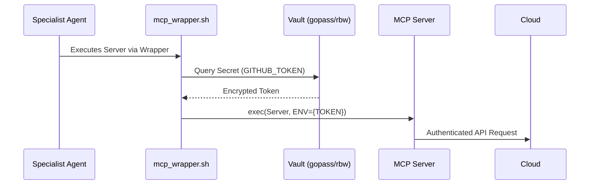

# Repository Architecture: THE ELITE SWARM

This document defines the high-precision, "Flat Expert" structure of the Programming-Work unified AI hub.

## 🏛️ The Infrastructure Layer Cake

The repository is organized into four core architectural pillars, each representing a specific layer of the swarm's cognitive and operational capabilities.

## 🛡️ Zero-Trust Credential Flow

Secrets never touch the repository. They are dynamically injected at runtime via the secure MCP wrapper.

---
*Maintained by the Swarm Supervisor — Status: HARDENED.*
