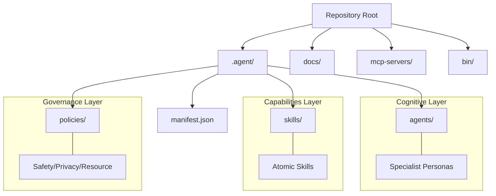
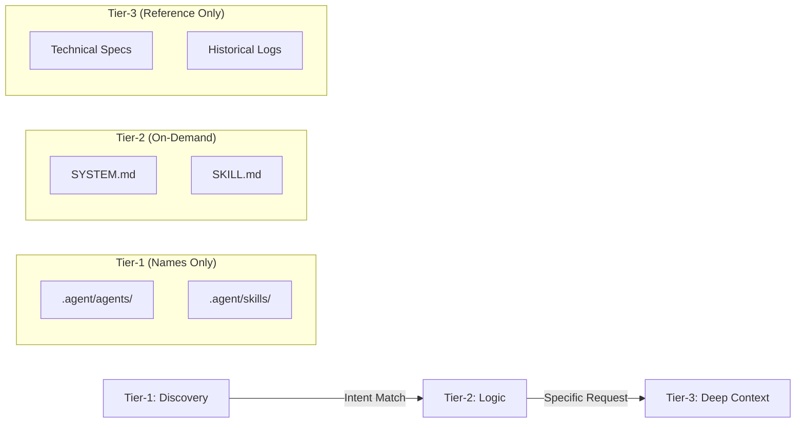
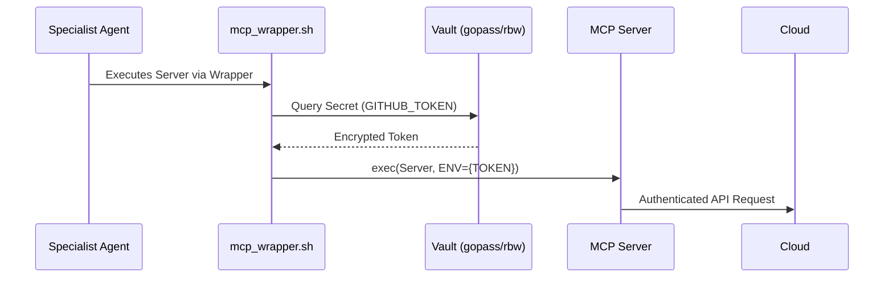

# Repository Architecture: THE Agent Swarm (2026)

This document defines the high-precision, "Unified Hub" structure of the repository, grounded in the **April 2026 Agentic Collaboration Standard (ACS)**.

## The Infrastructure Layer Cake

The repository is organized around the `.agent/` hub, which consolidates cognitive, operational, and governance layers into a single Physical Sovereignty point.

## Tiered Context Loading (ACS v1.2.0)

To maintain performance and security, context is ingested in three distinct tiers as defined in `acs.yaml`.

##  Zero-Trust Credential Flow

Secrets never touch the repository. They are dynamically injected at runtime via the secure MCP wrapper.

