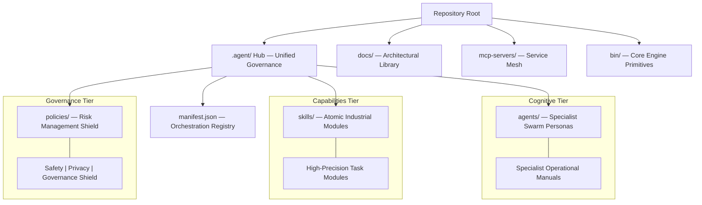
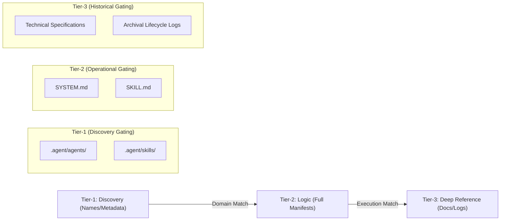
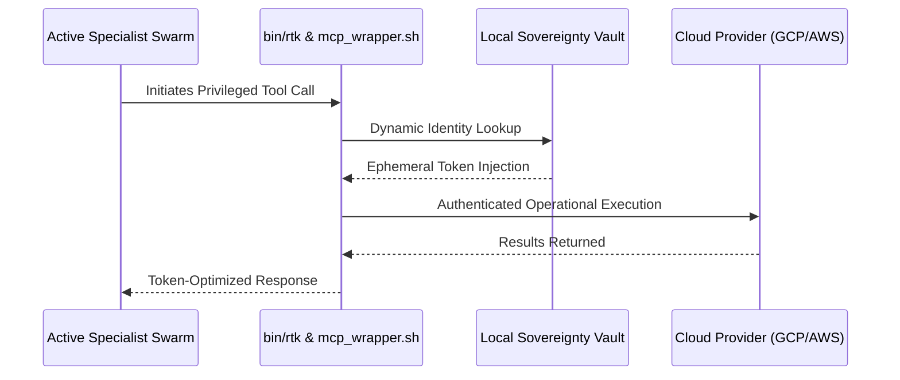

# Repository Architecture: Strategic System Design (2026)

## Executive Summary: The Hub-and-Spoke Governance Model
This repository implements a **Physical Sovereignty Hub** grounded in the **ACS-2026 Agentic Collaboration Standard**. By centralizing all cognitive logic, operational skills, and governance policies within the `.agent/` directory, we eliminate "Configuration Fragmentation" and ensure 100% deterministic behavior across heterogeneous IDE environments (Claude, Gemini, Copilot).

## 1. The Infrastructure Layer Cake

The system is architected to isolate systemic risk while maximizing capability reuse.

## 2. Tiered Context Gating (Blast Radius Management)

To maintain sub-50ms context retrieval and minimize token expenditure (SLO: 90% reduction), context is ingested via a three-tier "On-Demand" protocol.

## 3. Zero-Trust Security & Identity Injection

Identity and credentials are never persisted within the repository. We leverage a **Secure Proxy Injection** pattern using localized Vault drivers (`gopass`, `rbw`) and the MCP service mesh.

