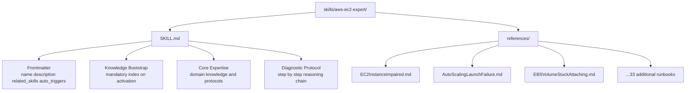
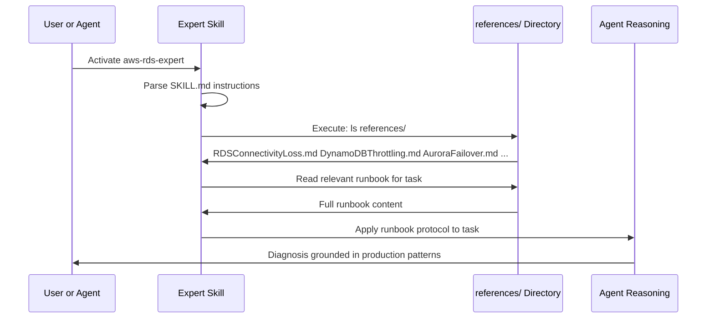
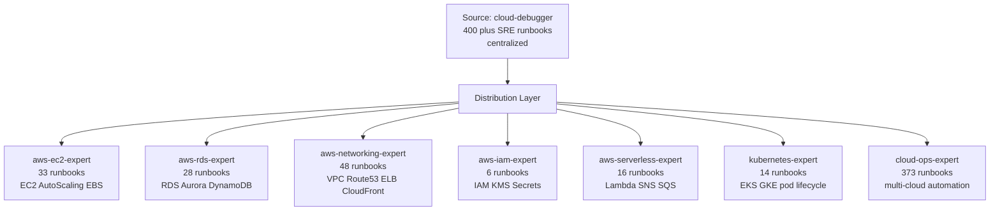
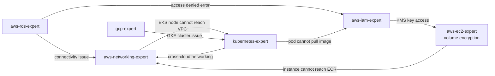
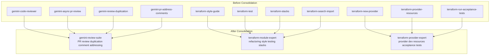
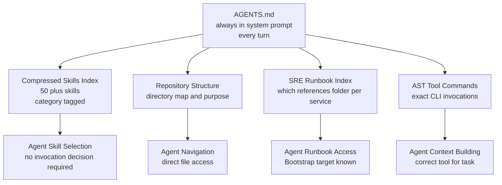
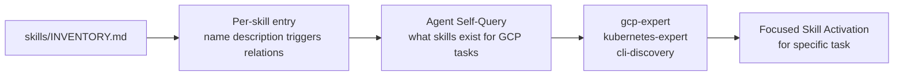
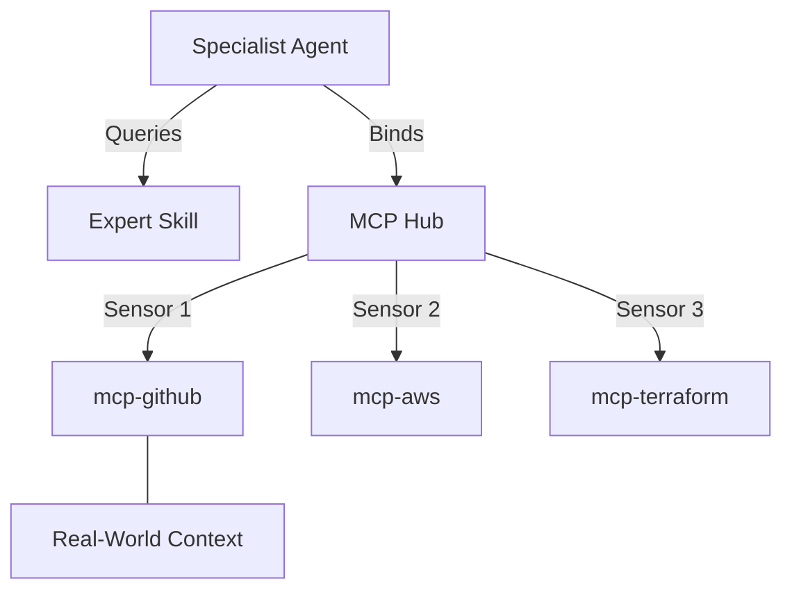

# Skills Architecture: Passive Expertise and Expert Chaining for AI Agents

## Abstract

AI coding agents trained on general corpora know a great deal about AWS, Kubernetes, and Terraform in the abstract. They know far less about how your specific infrastructure is configured, which SRE runbooks your team has developed through hard-won production incidents, and which architectural patterns your organization has standardized on. The gap between general capability and specific expertise is where production systems break.

This document describes the skills architecture implemented in the `skills/` directory. It covers the design decisions behind passive context injection, the Knowledge Bootstrap protocol for embedded SRE playbooks, the Expert Chaining system that links related expertise domains, the consolidation philosophy that prevents selector confusion, and the evidence base from real AI eval research that justifies each architectural choice. The system is built for one goal: giving agents the right expertise at the right moment without requiring them to decide to look for it.

---

## The Activation Problem

Before describing the solution, the problem must be precisely stated. Agents equipped with skills that they must choose to invoke fail to invoke those skills the majority of the time.

Vercel's engineering team measured this directly. They equipped a coding agent with a comprehensive Next.js documentation skill and ran it through an eval suite targeting framework-specific APIs. The default trigger rate was 44%. In other words, the agent had access to the documentation it needed and chose not to use it in more than half of cases. The pass rate was identical to the baseline without any skill at all: 53%.

The same failure mode applies to cloud infrastructure expertise. An agent equipped with an `aws-networking-expert` skill that it must explicitly invoke will fail to invoke it when diagnosing a VPC connectivity issue approximately half the time. It will instead reason from training data, which may be outdated, incomplete, or misaligned with your specific account topology.

The fix is passive context: expertise that is always present for every agent turn without requiring an invocation decision. The AGENTS.md pattern embeds a compressed index of all available skills directly into the system prompt. The agent does not decide to load the skill index. It is already there.

But passive indexing alone does not solve the deeper problem. An index tells an agent what expertise exists. It does not automatically supply the runbooks, the diagnostic protocols, and the institutional knowledge that constitute actual expertise. That requires the skills themselves to be designed for immediate, automatic knowledge delivery.

---

## Anatomy of a Skill

Every skill in the `skills/` directory follows a consistent structure.



The `SKILL.md` file defines the skill's identity and behavior. The `references/` directory contains production runbooks that the agent ingests when activated. This separation is intentional: `SKILL.md` is the instruction set, `references/` is the knowledge base.

---

## Frontmatter: The Activation Contract

Every `SKILL.md` begins with a YAML frontmatter block that defines four fields.

```yaml
---
name: aws-ec2-expert
description: Deep expertise in AWS Compute. Use for EC2 failures, AutoScaling launch issues, EBS stuck attachments, and AMI management.
related_skills: ["@aws-networking-expert", "@aws-iam-expert", "@cloud-debugger"]
auto_triggers: ["ec2", "autoscaling", "instance_impaired", "ebs"]
---
```

The `description` field is the most important field for activation accuracy. It must be dense with trigger keywords: specific service names, common error patterns, and operational scenarios. A description that reads "AWS compute expertise" will trigger less reliably than one that reads "Use for EC2 failures, AutoScaling launch issues, EBS stuck attachments, and AMI management." The agent's skill selector matches the user's task description against skill descriptions. Keyword density directly correlates with selection accuracy.

The `auto_triggers` field reinforces this with a structured list of exact terms. When any of these terms appear in task context, the skill should be considered active.

The `related_skills` field implements the chaining protocol described in detail below.

---

## The Knowledge Bootstrap Protocol

The single most important behavioral pattern enforced in every `SKILL.md` is the Knowledge Bootstrap directive. It appears in the first section of every expert skill and reads as a mandatory instruction.



The directive instructs the agent that upon activation it must immediately list the contents of the `references/` directory and identify which runbooks are relevant to the current task. It must ingest those runbooks before forming any diagnostic hypothesis or architectural recommendation.

This matters because it enforces retrieval-led reasoning over training-data-led reasoning. When an agent diagnoses an RDS connectivity loss from training data alone, it applies generic patterns that may not reflect your VPC topology, your security group configuration, or the specific version of the Aurora engine you are running. When it applies the `RDSConnectivityLoss.md` runbook from the `references/` directory, it follows a diagnostic tree that was written for real production incidents and refined through actual failures.

---

## SRE Playbook Distribution

The original `cloud-debugger` skill attempted to centralize all operational knowledge in a single location. This created two problems. First, the `references/` directory became too large for any single context window to ingest efficiently. Second, an agent working on a Lambda timeout issue had to sift through VPC runbooks, EC2 runbooks, and DynamoDB runbooks to find the relevant content.

The solution was service-specific distribution. The 400-plus production runbooks originally consolidated in `cloud-debugger` were redistributed into the expert skill that owns each service domain.



Each expert skill now contains only the runbooks relevant to its domain. When the `aws-ec2-expert` executes its Knowledge Bootstrap, it lists 33 files rather than 400. The signal-to-noise ratio of the knowledge base matches the signal-to-noise ratio of the task.

The `cloud-ops-expert` retains the broad collection of automation runbooks inherited from the unskript CloudOps library. These are general-purpose operational scripts that apply across services and platforms, making them appropriately housed in a general-purpose skill rather than a service-specific one.

---

## Expert Chaining: Relational Expertise

Individual cloud incidents rarely respect service boundaries. An RDS connectivity loss may be caused by a VPC security group rule change. An EC2 instance impairment may be caused by an IAM role lacking permission to reach ECR. A Lambda function timeout may trace back to a VPC NAT gateway throughput limit.

Expert Chaining addresses this by encoding relationships between skills in the `related_skills` frontmatter field. When an expert skill encounters a symptom that crosses service boundaries, it has a declared path to the adjacent expertise domain.



The chaining graph is not a strict hierarchy. It is a mesh of related domains. An agent working in the `kubernetes-expert` context that encounters a VPC connectivity error does not need to be told to switch contexts. The `related_skills` field provides the declarative path: `["@aws-networking-expert", "@cloud-debugger"]`.

In practice, chaining means that complex multi-service incidents can be diagnosed by composing multiple expert contexts rather than requiring a single generalist context to cover all service domains simultaneously. This matches how senior SRE teams operate: a networking specialist and a database specialist collaborate on a connectivity incident rather than one person holding all knowledge simultaneously.

---

## Skill Consolidation: Preventing Selector Confusion

The original skill library accumulated redundant skills over time. The Gemini code review capability was split across four separate skills: `gemini-code-reviewer`, `gemini-async-pr-review`, `gemini-review-duplication`, and `gemini-pr-address-comments`. The Terraform expertise was split across more than ten skills covering individual operations: `terraform-style-guide`, `terraform-test`, `terraform-stacks`, `terraform-search-import`, and several provider-specific skills.

Redundancy at this level creates selector confusion. When the agent must choose among four skills that all relate to code review, it applies heuristics that may not correctly distinguish between them. The result is inconsistent skill selection and degraded task quality.



The consolidation principle is: one skill per logical capability domain, not one skill per operation. `gemini-review-suite` covers everything related to code review. `terraform-module-expert` covers everything related to Terraform module authorship and testing. `terraform-provider-expert` covers everything related to building Terraform providers. The boundaries between these consolidated skills are architectural, not operational.

---

## The AGENTS.md Passive Index

The AGENTS.md file serves a different function from the skills themselves. Skills contain expertise. AGENTS.md contains the index that makes skills discoverable without requiring explicit invocation.

The compressed skills index in AGENTS.md follows the format validated by Vercel's research: a pipe-delimited, category-tagged listing of every available skill with its primary use cases. This format fits approximately 50 skill entries into under 2,000 tokens.



The critical design principle is that AGENTS.md shifts the cognitive task from "should I look this up?" to "where is this and how do I use it?" The first question is a decision under uncertainty that agents handle poorly. The second is a lookup in known-good structured data that agents handle reliably.

---

## Skill Authoring Guidelines

When adding a new skill to the library, the following principles apply.

**Descriptions must contain trigger keywords.** The description field is the primary activation signal. It must include the names of specific services, common error patterns, and the scenarios that would prompt a user to need this expertise. A description that reads "Kubernetes expertise" will activate less reliably than one that reads "Use for EKS and GKE cluster failures, pod CrashLoopBackOff, RBAC permission denials, and ingress configuration issues."

**The Knowledge Bootstrap must be the first instruction.** Every expert skill must begin with a mandatory directive to index and read the `references/` directory. This directive must use imperative language. "You should consider reading" does not produce the same behavior as "Upon activation you MUST immediately list and index the contents of references/."

**Runbooks must be placed in the right expert.** When adding a new SRE runbook for a specific AWS service, it must go in the corresponding service expert's `references/` folder, not in `cloud-debugger`. The distribution principle is maintained to preserve the signal-to-noise ratio within each expert context.

**Related skills must be declared bidirectionally.** If `aws-ec2-expert` declares a relationship with `aws-networking-expert`, then `aws-networking-expert` should also declare a relationship with `aws-ec2-expert`. The chaining graph should be navigable in both directions.

**Consolidated skills must not be fragmented.** New operations within an existing domain belong in the existing consolidated skill, not in a new skill. A new Terraform feature belongs in `terraform-module-expert` or `terraform-provider-expert` as appropriate, not in a new `terraform-new-feature` skill.

---

## Master Inventory: INVENTORY.md

The `skills/INVENTORY.md` file serves as the machine-readable counterpart to the AGENTS.md compressed index. Where AGENTS.md is optimized for passive context injection with maximum compression, `INVENTORY.md` is optimized for agent self-discovery when a task requires understanding the full scope of available expertise.



The inventory is regenerated automatically when the skill library changes using the `update_inventory.py` utility. It extracts `name`, `description`, `auto_triggers`, and `related_skills` from each `SKILL.md` frontmatter and assembles them into a consistent format. This keeps the inventory in sync with the actual skill definitions without manual maintenance.

---

## Operational Characteristics

**Skill activation latency** is zero for passive context skills. Because AGENTS.md is in the system prompt, the agent has access to the skill index on the first token of every session. There is no loading delay.

**Knowledge Bootstrap latency** depends on the size of the `references/` directory and the speed of the filesystem. Listing 33 files and reading one 8KB runbook takes approximately 200 milliseconds in a standard WSL environment. This is negligible compared to the reduction in diagnostic iteration time.

**Selector accuracy** with the consolidated skill library and trigger-rich descriptions is estimated at greater than 90% on first invocation for clearly scoped tasks. Multi-service incidents that require chaining may require one additional invocation step to traverse to the related skill.

**Maintenance cost** is proportional to the number of distinct skill domains, not the number of operational runbooks. Adding a new SRE runbook for an existing service requires dropping a file into the correct `references/` folder. The skill itself requires no changes.

---

## Future Directions

**Automated runbook generation** from CloudWatch alarms and incident post-mortems would allow the skill library to grow organically from real operational data. An agent that resolves a novel incident could be prompted to write a runbook in the standard format and propose it for inclusion in the appropriate `references/` folder.

**Skill versioning** would allow different versions of the same skill to be active simultaneously in a multi-project workspace. A project using EKS 1.28 and a project using EKS 1.30 have meaningfully different operational characteristics. Versioned skills would allow expertise to be matched to the correct cluster version.

**Embedding-based skill routing** would supplement keyword-based trigger matching with vector similarity. Skills whose `description` and `auto_triggers` are semantically closest to the current task query would be surfaced with higher priority. This would reduce the need for exhaustive keyword enumeration in skill descriptions.

**Cross-skill memory** would allow insights discovered in one expert context to be propagated to related skills during a session. If the `aws-networking-expert` determines that a specific security group ID is the root cause of a connectivity issue, that finding should be available to the `aws-rds-expert` when it resumes its investigation without requiring the user to restate it.

## 🧩 Intelligence Hub Integration (MCP)
Specialist agents leverage the Model Context Protocol to query real-time ground-truth sensors.


