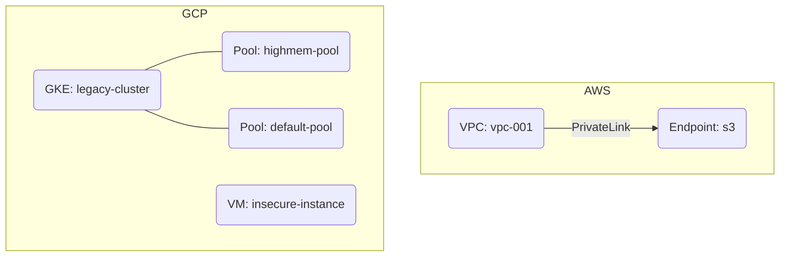

# Network Topology Report

```mermaid
graph TD
  %% Generated by nit-fabric visualizer
  subgraph AWS
    AWS_VPC:_vpc_001("VPC: vpc-001")
    AWS_Endpoint:_s3("Endpoint: s3")
  end
  subgraph GCP
    GCP_Pool:_highmem_pool("Pool: highmem-pool")
    GCP_GKE:_legacy_cluster("GKE: legacy-cluster")
    GCP_VM:_insecure_instance("VM: insecure-instance")
    GCP_Pool:_default_pool("Pool: default-pool")
  end
  AWS_VPC:_vpc_001 -- "PrivateLink" --> AWS_Endpoint:_s3
  GCP_GKE:_legacy_cluster --- GCP_Pool:_default_pool
  GCP_GKE:_legacy_cluster --- GCP_Pool:_highmem_pool
```
