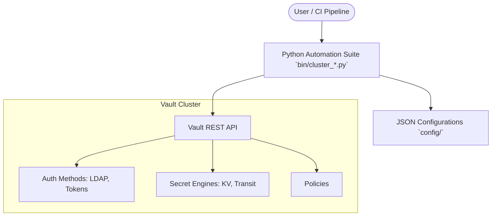

# Vault Automation: Introduction

Welcome to the Vault Automation Suite. This repository contains the Python-based scripts and configuration required to manage, deploy, and test HashiCorp Vault clusters in an automated, GitOps-friendly manner.

## Target Audience
This guide is primarily for **newcomers** to Vault and this automation project.

## Core Concepts

*   **Namespaces**: Logical isolation within Vault, acting like virtual Vault instances.
*   **Transit Secrets Engine**: Vault handles cryptographic functions (encryption/decryption) without storing the underlying data.
*   **Key-Value (KV) Store**: Vault's standard mechanism for storing arbitrary secrets.
*   **Wrapped Tokens**: Single-use tokens that wrap another response (like a real token or secret) securely, mitigating the risk of interception.

## High-Level Architecture

The Python scripts in the `bin/` directory wrap the standard Vault CLI and HTTP APIs, providing idempotent deployment workflows driven by JSON configuration files.

> [!NOTE]
> All automation scripts use a robust validation layer (`lib.validator_helper`) to ensure JSON syntax and schemas are correct before ever touching the Vault API.

## Where to go next?
- If you are configuring Vault servers, see [02_ADMIN_GUIDE.md](02_ADMIN_GUIDE.md).
- If you are a user deploying secrets or encrypting files, see [03_USER_WORKFLOWS.md](03_USER_WORKFLOWS.md).
- If you want to see test scenarios and command usage, see [05_EXAMPLES_AND_TESTS.md](05_EXAMPLES_AND_TESTS.md).
