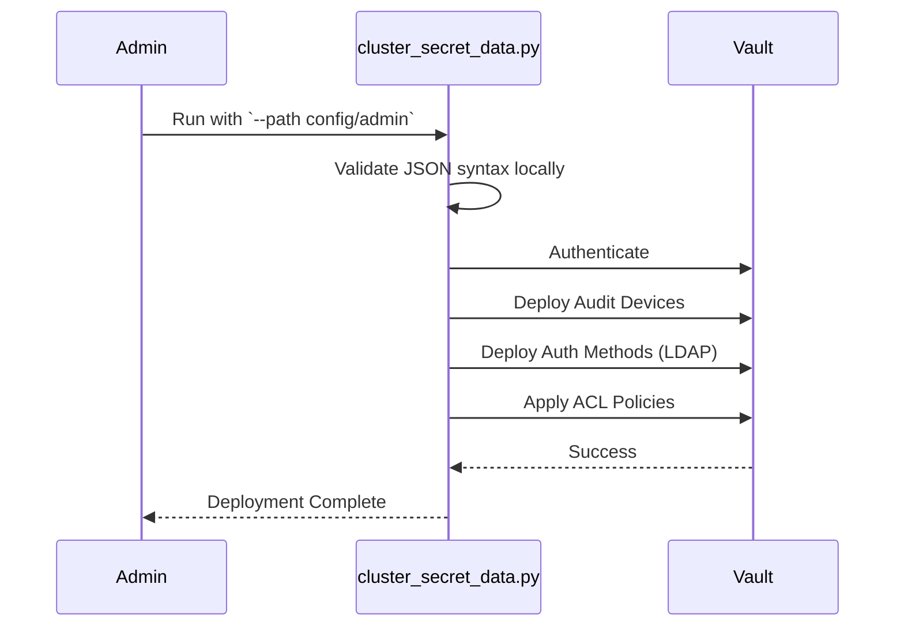

# Vault Automation: Admin Guide

This guide is designed for **Vault Administrators** responsible for maintaining the cluster configuration, authentication integrations, and backups.

## Configuration Deployment

The automation suite allows you to deploy Vault configurations declaratively via JSON.

### Admin Configuration
To deploy top-level administrative configurations (Auth methods, Audit devices, Base policies):

```bash
python3 bin/cluster_secret_data.py --name dev --path ./config/admin
```

### Namespace Configuration
To deploy configurations into a specific namespace (e.g., `app1`):

```bash
python3 bin/cluster_secret_data.py --name dev --path ./config/app1/secret_engines.json
```

## Admin Workflow Diagram



## Backup Operations
Administrators must ensure Vault data is backed up. Use the `cluster_backup.py` tool.

```bash
python3 bin/cluster_backup.py
```

> [!IMPORTANT]
> Ensure your VAULT_ADDR and VAULT_TOKEN environment variables are correctly exported with administrative privileges before executing the `bin/` scripts.
