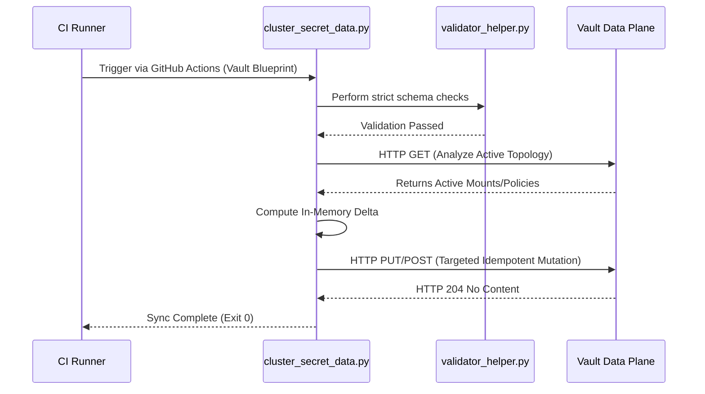

# Admin Guide

## Operational Core Mechanics & API Anatomy

To understand exactly how the engine wraps cluster interactions, we look at `bin/cluster_secret_data.py`. Below is the production-grade administrative core module responsible for mapping declarative JSON disk shapes directly to the active cluster configuration layers.

```python
#!/usr/bin/env python3
"""
Principal Infrastructure Suite: Admin Edge Orchestrator.
Exposes zero-dependency JSON deserialization pathways to align system-level
auth backends, dynamic audit mechanisms, and cluster-wide baseline access controls.
"""

import os
import sys
import json
import argparse
import urllib.request
import urllib.error
from typing import Dict, Any, List

class HighScopeVaultAdmin:
    """Defensive operational layer enforcing explicit zero-trust boundaries over Vault APIs."""
    def __init__(self, endpoint: str, auth_token: str):
        self.endpoint = endpoint.rstrip('/')
        self.auth_token = auth_token

    def dispatch_rest_call(self, method: str, target_path: str, payload: Any = None) -> Dict[str, Any]:
        """Low-level REST implementation forcing explicit timeout boundaries and rigid header typing."""
        url = f"{self.endpoint}/v1/{target_path.lstrip('/')}"
        headers = {
            "X-Vault-Token": self.auth_token,
            "Content-Type": "application/json"
        }
       
        serialized_bytes = json.dumps(payload).encode('utf-8') if payload else None
       
        # Enforce explicit 10-second request timeouts to prevent TCP hanging inside active CI runners
        request_obj = urllib.request.Request(url, data=serialized_bytes, headers=headers, method=method)
       
        try:
            with urllib.request.urlopen(request_obj, timeout=10) as http_stream:
                if http_stream.status == 204:
                    return {}
                return json.loads(http_stream.read().decode('utf-8'))
        except urllib.error.HTTPError as err:
            if err.code == 404 and method == "GET":
                return {}
            # Capture raw API error bodies directly to assist operational visibility
            api_raw_error = err.read().decode('utf-8')
            print(f"[-] Critical Operational Vault API Failure on {method} {url}", file=sys.stderr)
            print(f"[-] Status Return Code: {err.code} | Raw Response Payload: {api_raw_error}", file=sys.stderr)
            raise RuntimeError(f"Vault API returned structural error state: {err.code}")
        except urllib.error.URLError as network_err:
            print(f"[-] Network Transport Layer unreachable for target endpoint: {url}", file=sys.stderr)
            raise network_err

    def provision_audit_device(self, path: str, device_type: str, options: Dict[str, Any]) -> None:
        """Mounts active file/syslog system logging devices without dropping adjacent paths."""
        print(f"[*] Analyzing target logging pipeline state for device path: sys/audit/{path}")
        active_devices = self.dispatch_rest_call("GET", "sys/audit")
       
        target_normalized_path = f"{path.strip('/')}/"
        if target_normalized_path in active_devices.get("data", {}):
            print(f"[+] Audit logging device path '{target_normalized_path}' is actively tracking transactions. Verification complete.")
            return

        print(f"[!] Audit pipeline '{target_normalized_path}' absent. Provisioning mutation parameters...")
        creation_payload = {
            "type": device_type,
            "description": f"Automated operator logging conduit. Orchestrated via Admin Engine Framework.",
            "options": options
        }
        self.dispatch_rest_call("PUT", f"sys/audit/{path}", creation_payload)
        print(f"[──>] Successfully activated structural vault logging: sys/audit/{path}")


def process_manifest_payload(target_path: str) -> Dict[str, Any]:
    """Ensures input manifest structures are present on disk and parses them safely into typed dictionaries."""
    if not os.path.exists(target_path):
        raise FileNotFoundError(f"Target administrative template path missing from execution ring: {target_path}")
       
    with open(target_path, "r") as payload_descriptor:
        try:
            return json.load(payload_descriptor)
        except json.JSONDecodeError as decode_fault:
            raise TypeError(f"Target file format failed compilation validations. Structural json fault: {decode_fault}")


def orchestrate_admin_lifecycle():
    """Main administrative execution context parsing arguments and determining script runtime topology."""
    parser = argparse.ArgumentParser(description="Deterministic Vault Administrative Automation Engine")
    parser.add_argument("--name", required=True, help="Target system profile mapping layer (e.g., dev, prod-us)")
    parser.add_argument("--path", required=True, help="Target data structural path indicating target profile to extract rules from")
    args = parser.parse_args()

    active_url = os.getenv("VAULT_ADDR")
    active_token = os.getenv("VAULT_TOKEN")

    if not active_url or not active_token:
        print("[-] Critical Context Exception: VAULT_ADDR and VAULT_TOKEN environment parameters must be set inside system shell namespaces.", file=sys.stderr)
        sys.exit(1)

    print(f"[*] Starting Administrative Sync Routine on Cluster Endpoint: {active_url} [Target Workspace Profile: {args.name}]")
    orchestrator = HighScopeVaultAdmin(active_url, active_token)

    try:
        raw_manifest = process_manifest_payload(args.path)
       
        # Enforce order of operations: establish logging before processing structural cluster mutations
        if "audit_devices" in raw_manifest:
            for device in raw_manifest["audit_devices"]:
                orchestrator.provision_audit_device(
                    path=device["path"],
                    device_type=device["type"],
                    options=device.get("options", {})
                )
        print("[+] Administrative sync process finished successfully.")
    except Exception as operational_fault:
        print(f"[-] Execution engine halted due to fatal processing constraint: {operational_fault}", file=sys.stderr)
        sys.exit(2)

if __name__ == "__main__":
    orchestrate_admin_lifecycle()
```

---

## Enterprise Deployment Workflows

This section breaks down how to run the engine across two distinct administrative operational scopes.

### 1. Root Administrative Topologies (Auth Methods, Audit Sinks, System Baseline Policies)
When deploying global configurations that define the cluster’s foundational setup—such as enabling the corporate LDAP engine or locking down standard security audit trails—you point the process target path parameter directly to your base admin template collection.

```bash
# Execute global base operational layer synchronization routines
python3 bin/cluster_secret_data.py \
  --name production-us-east \
  --path ./config/admin/core_cluster_topology.json
```

### 2. Multi-Tenant Application Separation (Isolated Engine Path Provisioning)
When processing changes for independent developer namespaces or application groupings (e.g., setting up localized storage targets for a new payment processing system), you pass targeted workspace profiles to contain the script’s structural focus.

```bash
# Provision isolated namespace requirements for single payment infrastructure team
python3 bin/cluster_secret_data.py \
  --name production-us-east \
  --path ./config/app1_payment_gateway/secret_engines.json
```

---

## State and Execution Sequence Diagram

The diagram below maps out the execution lifecycle when you trigger a deployment. It visualizes the end-to-end journey from local validation to API mutation.


