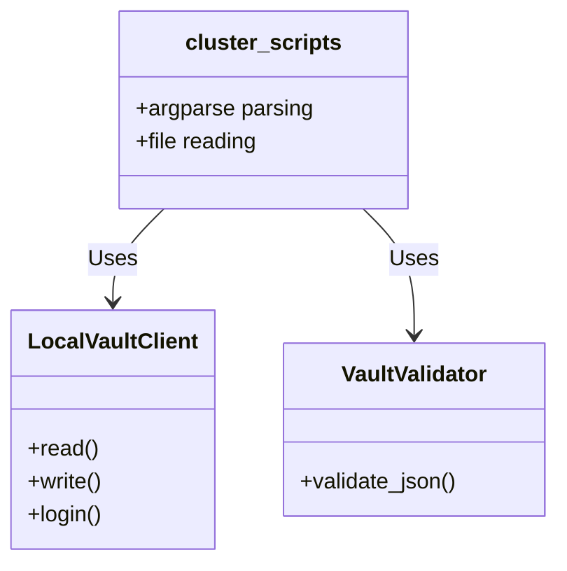

# Vault Automation: Developer Guide

This guide is for **Python Developers** looking to extend the automation framework or write new tests.

## Code Architecture

The repository enforces a strict separation between CLI logic and underlying Vault connectivity.



### 1. `bin/` Directory
Contains all runnable CLI scripts (`cluster_secret_data.py`, `cluster_ops.py`, `cluster_encrypt_ops.py`). These scripts parse command-line arguments and invoke the library classes.

### 2. `lib/` Directory
Contains the reusable classes:
*   `lib.vault_client.LocalVaultClient`: Wraps the Vault API logic.
*   `lib.validator_helper.VaultValidator`: Standardized JSON and schema verification.
*   `lib.vault_helper`: Utility functions for string parsing.

## Writing Tests

We use `pytest` for all unit and integration testing.

The integration tests are located in `tests/test_integration.py`. This file utilizes a `pytest.fixture(scope="function")` to automatically spin up a temporary, local `vault server -dev` instance for each test.

### How to add an Integration Test
1. Open `tests/test_integration.py`.
2. Define a function starting with `test_`.
3. Pass the `vault_server` fixture as an argument.
4. Execute your subprocess and assert the results.

```python
def test_my_new_feature(vault_server):
    env = vault_server
    # Run the script against the background vault instance
    res = subprocess.run(["python3", "bin/cluster_ops.py", "list"], env=env, capture_output=True, text=True)
    assert res.returncode == 0
```
